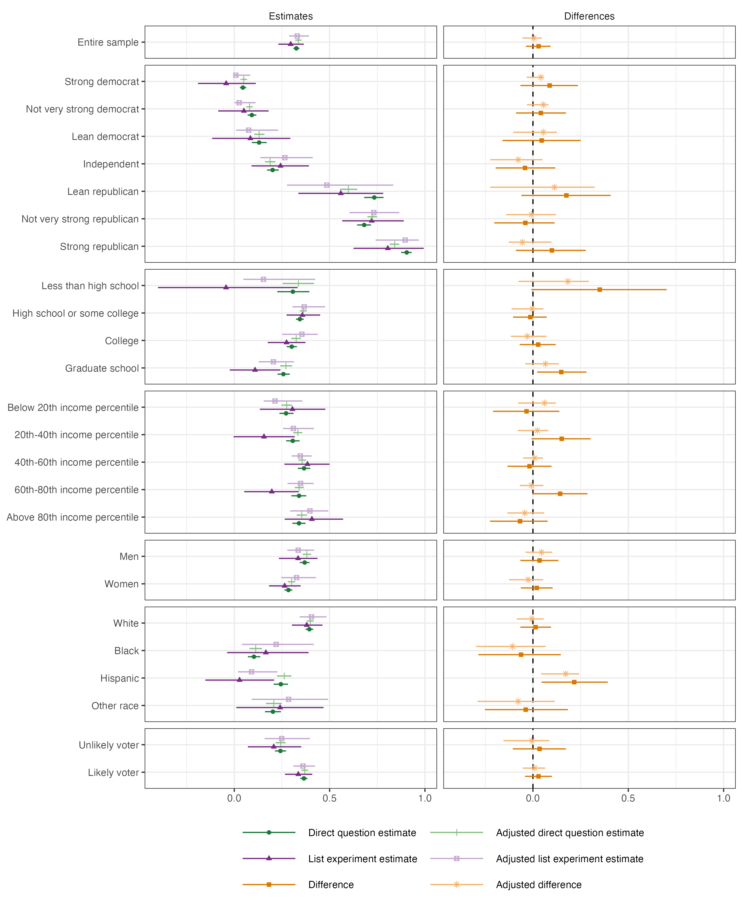

# Reproducibility Report: Coppock (2017)


- [Summary](#summary)
  - [Does the deposited archive run?](#does-the-deposited-archive-run)
  - [Does the maintained rewrite reproduce the
    paper?](#does-the-maintained-rewrite-reproduce-the-paper)
- [Paper overview](#paper-overview)
- [Original archive reproducibility](#original-archive-reproducibility)
- [Errata](#errata)
- [What counts as a claim](#what-counts-as-a-claim)
- [Number-by-number comparison](#number-by-number-comparison)
- [Published Table 2](#published-table-2)
- [Published Figure 1](#published-figure-1)
- [Bootstrap standard errors](#bootstrap-standard-errors)
- [Maintained rewrite](#maintained-rewrite)
  - [Architecture](#architecture)
  - [Deprecated patterns replaced](#deprecated-patterns-replaced)
  - [How much of the bootstrap the adjusted estimates actually
    use](#how-much-of-the-bootstrap-the-adjusted-estimates-actually-use)
- [Maintained rewrite verification](#maintained-rewrite-verification)
- [R environment](#r-environment)

*Drafted by Claude Opus 5 under the supervision of Alex Coppock.*

This repository holds the actively maintained replication code for
Coppock (2017), together with the reproducibility report that documents
what the original archive did and did not do. It is part of a program
applying the maintenance proposal in Peer, Orr and Coppock (2021, *PS:
Political Science & Politics*, doi
[10.1017/S1049096521000366](https://doi.org/10.1017/S1049096521000366))
to a set of published archives.

|  |  |
|----|----|
| Article | [10.1515/spp-2016-0005](https://doi.org/10.1515/spp-2016-0005) |
| Replication archive | [10.60600/YU/Z88TZQ](https://doi.org/10.60600/YU/Z88TZQ) |
| Pre-analysis plan | None |

**The data are not redistributed here.** The deposit is 3 files and 0.5
MB, and it lives in the Yale Dataverse rather than at Harvard, where
most archives in this program sit. `download_original.R` fetches it and
verifies every file; `original_manifest.csv` pins the file identifiers,
sizes and checksums, so the exact bytes this code was written against
are recorded in version control even though the bytes themselves are
not.

**Repository layout.** `maintained/` is the maintained rewrite: one
script per published table or figure, writing to `output/`, which is
committed so a reader can compare a fresh run against it without
downloading anything. One file in `output/` is not committed.
`trump.rds` is the deposited respondent-level file serialised, with
nothing recoded, added or dropped, so committing it would redistribute
the deposit by another route; `clean_trump.R` rebuilds it from
`original/` in seconds. `ground_truth/` holds three things: the
hand-classified list of every number the article prints, a script that
runs the deposited archive itself and records what it produces, and a
script that ties every published number to both that run and the
rewrite. `original/` is created by the download script and is
deliberately absent from the repository. This file is the
reproducibility report, also available as a PDF in `report/`.

**License.** CC0 1.0 Universal, matching the terms of the deposit this
repository maintains. See `LICENSE`.

**To reproduce.** Clone or download the repository, open
`coppock_2017a.Rproj`, and run:

``` r
source("run_all.R")
```

That fetches the deposit, verifies its 3 files, produces the published
table, figure, appendix table and in-text quantities into
`maintained/output/`, runs the deposited script 4 times, rebuilds the
ground truth from all of it, prints every published number beside the
sentence that states it, and verifies the deposit again. Required
packages: tidyverse, estimatr, survey, list, rsample, knitr, kableExtra,
here. Paths resolve through `here`, so nothing depends on the working
directory.

The run that produced the committed output took 34 minutes, recorded
step by step in `run_timings.csv`. Every duration quoted below is read
from that file rather than estimated, so none of them can go stale; they
are wall clock on one machine and indicative rather than a benchmark.
10.3 minutes of that is Figure 1, which refits 6 estimators in 25
subgroups across 2,000 bootstrap replicates and is almost the whole cost
of the rewrite. Most of the rest is the deposited script, which does the
same work more slowly and is run 4 times, at two replicate counts, under
both of R’s samplers, and against two sets of inputs. Anyone who wants
only the rewrite can run the 7 scripts in `maintained/` and stop; the
two `ground_truth/` scripts are the comparison against the deposit and
against the article, and nothing in `maintained/` depends on them. A
successful run overwrites `maintained/output/`, which is committed:
**`git diff` on that folder is the reproduction check.** The CSV and TeX
output comes back byte-identical; the PDF figure always shows as
changed, because a PDF records the time it was written, so compare its
PNG twin instead.

# Summary

Two questions, answered before the detail.

## Does the deposited archive run?

Yes. The deposit is a single script, `shy_trump_analysis.r`, and it runs
start to finish under R 4.6.0 with no change to any line of analysis.
All 4 runs of it recorded in `ground_truth/original_archive_runs.csv`
completed, with deprecation warnings and no errors. One dependency is
missing from its own commented `install.packages()` line, which names
seven packages: the script also calls `arm::invlogit()`,
namespace-qualified, so `arm` has to be installed and is never named.
Every other package the script needs is on that line and every one of
them installs and runs today, including `coefplot`, which supplies the
`position_dodgev()` behind the figure.

Three things about the deposit matter more than whether it executes.

It writes nothing. There is not one uncommented call in the deposited
script that saves a file: both tables are printed to the console as
LaTeX and the figure is drawn to the active device, which under
`Rscript` leaves a stray `Rplots.pdf` in the working directory and
nothing else. Whatever a reader gets by running it has to be read off
the screen. That decides what a checksum of the deposit can and cannot
mean here, because there is no artifact of the archive for anyone to
diff.

It ships with `sims <- 200` and a comment saying the article used 2,000,
so what the deposit runs out of the box is not the configuration its own
comment describes. The article never states a replicate count, which
makes that comment the only record of one.

Its headline comparison is computed as `0.32547778 - tidy(fit_r)[2,2]`,
with the direct-question estimate typed in as a literal rather than read
from the data.

## Does the maintained rewrite reproduce the paper?

Every point estimate, yes. Every bootstrap standard error, no, and
neither does the deposit.

Of 392 recorded claims, 12 are numbers the article takes from outside
the data (fivethirtyeight forecasts and election returns) and cannot be
checked against the deposit, and 5 is a cell the article leaves blank.
Of the 375 that remain, the rewrite matches 225 at the precision the
article prints. Splitting that number is the whole story.

**Point estimates and counts.** 211 are checked. 35 of them are the
income rows of Figure 1 and Table A1, where the deposited script
attaches each block of numbers to the wrong quintile label; the rewrite
prints the label the data supports, so it disagrees with the page by
construction. See the Errata section. 3 more disagree, and each is the
article disagreeing with itself or with its own data rather than with
anyone’s code: *Direct question, other or undecided (%)*, *Direct minus
list experiment (pp)*, and *Points on the income scale entering the
response model*. Every other point estimate, count and sample size in
the article reproduces exactly.

**Bootstrap standard errors.** 124 are checked, leaving the income rows
aside, and the rewrite matches 41. The deposited script does neither
better nor worse: it matches 41 of the same 124, and the two draw the
same bootstrap, cell for cell. The reason is given in the deposit’s own
header. The resampling code was rewritten in October 2019, two years
after publication, when tidyverse bootstrapping moved to `rsample`, so
the code that produced the published standard errors is not the code in
the archive. No configuration of what is there recovers them, including
the sampler R used before version 3.6.0. Every substantive conclusion in
the article turns on whether an interval covers zero, and every one of
those is unchanged.

**Sentences with no number in them.** 14 of the article’s claims are
about the shape, sign or count of its own estimates rather than about a
value: that Whites were more likely to support Trump than any other
category, that most of the unadjusted intervals contain zero, that the
income groups did not diverge wildly. Nothing in a number-by-number
comparison reaches them, and they are where a description can go on
standing after the estimate beside it has moved. 10 of the 14 reduce to
a verdict, and 10 of those hold. The remaining 4 name no threshold, so
they get their evidence printed and no verdict.

**One finding is neither a match nor a mismatch.** The
covariate-adjusted list experiment estimate is a nonlinear least squares
fit, and it fails outright on 997 of the 2,000 bootstrap replicates. The
deposited script and the rewrite handle those failures identically, by
dropping them, so the adjusted intervals in the published Figure 1 and
Table A1 rest on roughly half the replicates the deposit’s own comment
names. Nothing in the comparison table shows this, because both sides
agree; it is visible only by counting.

# Paper overview

Coppock (2017) asks whether the 2016 polling miss can be explained by
Trump supporters concealing their vote preference from pollsters, the
“Shy Trump Supporter” hypothesis. A Reuters/IPSOS survey of 5,290
American adults, fielded 2 to 13 September 2016, asked vote preference
directly and, later in the same instrument, ran a list experiment
carrying the Trump item. If some supporters hide from the direct
question, the list experiment should recover more support than the
direct question does.

It recovers less. The direct question puts Trump support at 32.5%; the
list experiment puts it at 29.6%. The article then looks for subgroups
in which the two modes diverge, across party identification, education,
income, gender, race and modeled vote propensity, unadjusted and
covariate adjusted. Of 25 subgroups, 1 adjusted difference excludes
zero. The article reports a combined estimator from Aronow, Coppock,
Crawford and Green (2015) and the joint test of its assumptions, which
the data fail.

The published quantities are Table 2 (the distribution of list
responses), Figure 1 (the subgroup comparison), Appendix Table A1 (the
same estimates as a table), and 29 statements of a quantity in the
running text, several of which restate the same number in a different
section. Table 1 is the wording of the two lists and carries no numbers,
so it has no ground-truth row. Figure 1 plots exactly the estimates
Table A1 prints, so the two share their rows.

# Original archive reproducibility

The deposit is 3 files: a README, the respondent-level data as CSV, and
one analysis script.

| File                  |   Bytes | Served as             |
|:----------------------|--------:|:----------------------|
| README.txt            |     519 | README.txt            |
| shy_trump_analysis.r  |  11,439 | shy_trump_analysis.r  |
| shy_trump_cleaned.csv | 481,797 | shy_trump_cleaned.tab |

All 3 checksums agree three ways: the MD5 Dataverse publishes, the MD5
of the bytes `?format=original` returns, and the MD5 of the copy this
rewrite was developed against. `shy_trump_cleaned.csv` is ingested, so
Dataverse serves it as `shy_trump_cleaned.tab` unless `?format=original`
is passed; the published checksum describes the deposited CSV, not the
derived tabular file, which is what makes the three-way agreement
possible.

**The deposit is not on Harvard Dataverse.** It began in the Yale ISPS
Data Archive under the handle `hdl:10079/zw3r2f9` and now lives in the
Yale Dataverse under `doi:10.60600/YU/Z88TZQ`. The two locators are not
interchangeable for a reader. The handle still resolves, but it resolves
to `isps.yale.edu/research/data/d149`, which returns 404. The DOI is the
only working pointer to the deposit, and it is the one recorded in
`original_manifest.csv` and `download_original.R`. Yale Dataverse is a
separate installation of the same software Harvard runs, so the file API
and the `?format=original` convention are identical; only the host and
the DOI prefix differ.

**The archive runs.** `shy_trump_analysis.r` executes to completion in a
clean session, with its own analysis untouched. Its `setwd("")` line is
commented out and marked “Uncomment to set working directory”, so it
reads its data from wherever it is run and has to be run from the folder
holding the deposited CSV, or given that line. Four issues are worth
recording.

| Issue | Detail |
|----|----|
| Incomplete install line | The commented `install.packages()` names seven packages, which are exactly the seven the script loads with `library()`. It also calls `arm::invlogit()`, and `arm` appears nowhere in the line. |
| A dependency worth checking rather than assuming | The figure dodges with `position_dodgev()`, which `coefplot` exports and which originated in `ggstance`. `ggstance` is superseded by ggplot2’s own support for horizontal geoms. `coefplot` is not: its current release is 1.2.9, dated 2025-08-23. Both install and both run, and the call is not broken. |
| Deprecations | `geom_errorbarh()` is deprecated in ggplot2 4.0; `gather()`/`spread()` and `do(data_frame(...))` are superseded. All still run. |
| Stray output | The script writes `Rplots.pdf` into the working directory, because the figure is printed to the default device rather than saved. |

**The deposit against its own README.** The deposited `README.txt`
describes exactly the two files that are there and says the script
“conducts all analyses reported in the paper”, which it does: Table 2,
Figure 1, Table A1 and every number in the running text all come out of
it, and the only published float it does not produce is Table 1, which
is the wording of the two lists rather than an analysis. The one
discrepancy is a letter. The README calls the script
`shy_trump_analysis.R` and the deposited file is `shy_trump_analysis.r`.
That costs nothing on macOS or Windows and breaks a copied instruction
on Linux, which is why every path in this repository is written to match
the deposit exactly rather than to match its documentation.

**The published number typed into the code.** The deposited script
computes the headline comparison as

``` r
0.32547778 - tidy(fit_r)[2,2]
```

The direct-question estimate is a literal. It agrees with the value the
data give to within 7.7e-10, but nothing in the script checks that, and
a reader cannot tell from the code where it came from. The rewrite
computes both terms from the data.

**The replicate count.** The deposit ships

``` r
# The bootstrap sims take a while.  The article uses 2000 sims
# sims <- 2000
sims <- 200
```

so running the deposit as deposited does not run the configuration the
comment describes. Both claims in that comment were tested rather than
repeated, which is why the deposited script is run here at both
replicate counts.

The first claim cannot be confirmed from the article. The article says
its standard errors and intervals come from the nonparametric bootstrap
and nowhere states how many replicates were drawn: not in the text, not
in the note to Table A1, not in a footnote. The deposit’s comment is the
only statement of 2,000 anywhere in the record, and the rewrite adopts
it for that reason rather than because the article corroborates it.

The second claim is a matter of measurement, and the answer is that
neither count recovers the published standard errors and the two are
hard to tell apart. Across the 120 standard errors Table A1 prints for
the non-income subgroups, the deposited script at 2,000 replicates
matches 39 and lands 0.13 points from the published figure on average;
at the 200 it ships it matches 37 and lands 0.26 points away. The point
estimates are unaffected either way, since they do not depend on the
bootstrap. The shipped configuration is therefore not what makes the
standard errors irreproducible, and “take a while” was 11.2 minutes at
2,000 replicates on the run that produced this report, against 1.1 at
200. The rewrite drew the same 2,000 replicates in 10.3 minutes.

**How the archive is run here.** `ground_truth/run_original_archive.R`
copies the deposit into a scratch directory, because the script writes
`Rplots.pdf` into its working directory and an archive that writes into
itself can overwrite part of the deposit. It makes three edits to the
copy and no others. Two of them fill in lines the deposit itself marks
as configurable: the commented `setwd("")`, which the deposit says to
uncomment, and `sims <- 200`, which the deposit says the article set to
2,000. The third appends a block that saves objects the script has
already computed. The `value_script` column of the ground truth is read
out of that block, never transcribed.

Three of the four runs use a scratch copy holding the deposited script
and the deposited CSV and nothing else. A script that runs against an
archive as downloaded can pass by loading an intermediate the archive
ships rather than one it built, and removing everything that is neither
code nor data is the only way to tell the two apart. This deposit ships
no intermediates, so the test passes trivially, but it is run and
recorded rather than assumed. The fourth run is the same 200-replicate
configuration against every file the deposit contains, and the two are
asserted to return identical numbers, so the stripped runs are checked
against their own control rather than left as a claim about intent.

Each run also records, by modification time, which deposited files it
wrote over. That is the measurement behind the rule against running an
archive in place, and here it comes back empty: the deposited script
writes nothing at all, so running it in place would have damaged
nothing. That is a fact about this deposit and not a general one, and it
is cheap enough to measure on every run.

| Run | Replicates | Sampler | Inputs | Status | Files left behind | Deposited files overwritten |
|:---|---:|:---|:---|:---|:---|:---|
| current | 2,000 | Current | code and data only | completed | Rplots.pdf | none |
| rounding | 2,000 | Pre-3.6.0 | code and data only | completed | Rplots.pdf | none |
| shipped | 200 | Current | code and data only | completed | Rplots.pdf | none |
| shipped_as_deposited | 200 | Current | as shipped | completed | Rplots.pdf | none |

# Errata

**The deposited script mislabels the income quintiles, and the error
reached the published Figure 1 and Table A1.**

The script builds a factor whose levels are the values found in the data
and whose labels are the names the article prints:

``` r
group = factor(group,
  levels = c(..., "income_quintile_20th - 40th Income Percentile",
                  "income_quintile_40th - 60th Income Percentile",
                  "income_quintile_60th - 80th Income Percentile",
                  "income_quintile_Above 80th Income Percentile",
                  "income_quintile_Below 20th Income Percentile", ...),
  labels = c(..., "Below 20th Income Percentile",
                  "20th - 40th Income Percentile",
                  "40th - 60th Income Percentile",
                  "60th - 80th Income Percentile",
                  "Above 80th Income Percentile", ...))
```

The levels are typed in alphabetical order, which is the order R would
sort them into anyway. The labels are typed in substantive order. Every
other block in the same call lines up, because for party identification,
education, gender, race and vote propensity the alphabetical and
substantive orders coincide. For income they do not, and the five income
labels are rotated by one position. Each income row is printed under the
label of the quintile below it, and the bottom quintile is printed as
the top one.

The direction of the error is not a matter of interpretation.
`income_quintile` is a self-describing character variable, and its five
categories partition the deposited household income measure `USHHI2`
into contiguous blocks in exactly the order their names claim:

| income_quintile               | USHHI2 range |    N |
|:------------------------------|:-------------|-----:|
| Below 20th Income Percentile  | 1 to 4       |  804 |
| 20th - 40th Income Percentile | 5 to 8       | 1038 |
| 40th - 60th Income Percentile | 9 to 14      | 1361 |
| 60th - 80th Income Percentile | 15 to 18     |  936 |
| Above 80th Income Percentile  | 19 to 24     | 1151 |

`maintained/clean_trump.R` asserts this ordering and writes the table
above, so the fact is checked on every run rather than asserted once in
prose.

**What changes.** The published Table A1 row “Below 20th income
percentile” reports N = 1,038 and a direct-question estimate of 30.7%.
Those numbers belong to the 20th to 40th quintile. The bottom quintile
has N = 804 and a direct-question estimate of 27.2%, which the article
prints under “Above 80th income percentile”. The same rotation appears
on the income block of Figure 1.

**What does not change.** No estimate is wrong, no standard error is
wrong, and no conclusion in the article turns on it. The article’s claim
about income is that “different income groups did not diverge wildly in
their support,” which is as true of the correctly labeled rows as of the
rotated ones. What changes is which five-row block of numbers belongs to
which quintile.

The maintained rewrite prints the labels the data supports. Those 64
ground-truth rows therefore carry `match_rewrite = 0` with a note
recording that the disagreement is intentional.

# What counts as a claim

Before anything is compared, the article and its appendix are read end
to end and every numeric token is written down with its location, then
classified by hand. That list is `ground_truth/published_claims.csv`,
401 rows, and it is the only place in this repository where a published
number is written down at all. Extracting exhaustively rather than
searching for a pattern is the point: a search for bare digits misses a
number inside a larger expression, and a search built around one
notation misses everything written in another.

| Class | Claims | Meaning |
|:---|---:|:---|
| pipeline | 366 | The deposited data determines it, so the rewrite must produce it |
| descriptive | 14 | A claim about shape, sign or count rather than a value, needing a computed truth value |
| definitional | 6 | A scale endpoint, a category count, a null value being tested |
| structural | 3 | Field dates, an axis range: a fact about the study rather than a result |
| transcribed | 12 | Copied from a forecast, the election returns or another paper, and unable to drift |

Every claim classified `pipeline` or `descriptive` is then checked
twice, by two instruments that share no code.
`ground_truth/build_ground_truth.R` joins it to the deposited script’s
output and to the rewrite’s and records the verdict.
`maintained/in_text_claims.R` carries the article’s own sentence in a
comment, recomputes the number from `maintained/output/` by its own
path, and prints it beside the sentence in the order a reader meets it.
Neither reads the other, and the build stops if a claim in the
extraction is missing from either. Two paths to the same number are what
makes a disagreement between them visible; one path can only be
believed.

The remaining classes are exempt by construction rather than by
omission. Nothing the pipeline does can move a field date, a scale
endpoint, or a share of the vote in Wisconsin.

# Number-by-number comparison

The ground truth carries one row per published number, with three values
beside each other: what the article prints, what the deposited script
produces when run today, and what the maintained rewrite produces. The
second and third are read out of files rather than typed.

The published value is stored as the string the page prints, and a value
counts as agreeing when printing it to that string’s own precision gives
that string’s own digits. The comparison is between two pieces of text,
not between a number and a tolerance. Two things follow. A published
`3.0` is held to one decimal and a published `3` to none, a distinction
a numeric published value cannot make, since `3.0` and `3` are the same
double. A value sitting exactly on a rounding boundary is also decided
by the same rule the typesetter used rather than by an inequality that
happens to point the other way.

| Block | Claims | Archive checked | Archive matches | Rewrite checked | Rewrite matches |
|:---|---:|---:|---:|---:|---:|
| Figure 1 and Table A1 | 325 | 325 | 227 | 325 | 180 |
| Table 2 | 12 | 11 | 11 | 11 | 11 |
| In-text | 29 | 27 | 23 | 29 | 24 |
| Descriptive | 14 | 0 | 0 | 10 | 10 |
| External to the data | 12 | 0 | 0 | 0 | 0 |

Splitting the checked claims by whether they are point estimates or
bootstrap standard errors separates the two kinds of disagreement.

| Kind                               | Claims | Archive matches | Rewrite matches |
|:-----------------------------------|-------:|----------------:|----------------:|
| Point estimates and counts         |    212 |             207 |             173 |
| Bootstrap standard errors          |    153 |              54 |              42 |
| Claims about shape, sign and count |     10 |               0 |              10 |

Every row that does not match carries a `defect_locus` recording where
the disagreement lives.

| Defect locus | Rows | Meaning |
|:---|---:|:---|
| archive | 147 | The deposited code, which either produced the published value and no longer exists in the deposit, or produced a label the data does not support |
| paper_internal | 3 | The article disagreeing with its own tables or with its own data |

Every in-text quantity the article states is listed below with the value
the rewrite produces.

| Claim | Published | Rewrite | Match |
|:---|---:|---:|:--:|
| Respondents surveyed (abstract) | 5290 | 5290 | yes |
| Direct question, Trump support (%), abstract | 32.5 | 32.548 | yes |
| List experiment estimate of Trump support (%), abstract | 29.6 | 29.578 | yes |
| Respondents surveyed (design) | 5290 | 5290 | yes |
| Direct question, Trump support (%) | 32.5 | 32.548 | yes |
| Direct question, Clinton support (%) | 37.0 | 37.015 | yes |
| Direct question, other or undecided (%) | 30.5 | 30.438 | no |
| Direct question, Trump support (%), restated in the design section | 32.5 | 32.548 | yes |
| List experiment, control group mean (items) | 1.548 | 1.548 | yes |
| List experiment, treatment group mean (items) | 1.843 | 1.843 | yes |
| List experiment estimate of Trump support (proportion) | 0.296 | 0.296 | yes |
| List experiment estimate of Trump support (%) | 29.6 | 29.578 | yes |
| Direct question, Trump support (%), restated in the results section | 32.5 | 32.548 | yes |
| Direct minus list experiment (pp) | 2.9 | 2.97 | no |
| Bootstrap SE of direct minus list (pp) | 3.4 | 3.339 | no |
| Share not reporting Trump support (%) | 67.5 | 67.452 | yes |
| Non-disclosers, control group mean (items) | 1.610 | 1.61 | yes |
| Non-disclosers, treatment group mean (items) | 1.642 | 1.642 | yes |
| List experiment estimate among non-disclosers (%) | 3.3 | 3.272 | yes |
| Subgroups compared | 25 | 25 | yes |
| Points on the party identification scale entering the response model | 7 | 7 | yes |
| Points on the income scale entering the response model | 22 | 24 | no |
| Combined estimate of Trump support (%) | 34.8 | 34.755 | yes |
| SE of the combined estimate (pp) | 2.9 | 2.942 | yes |
| Combined minus direct (pp) | 2.2 | 2.207 | yes |
| SE of combined minus direct (pp) | 2.9 | 2.829 | no |
| Joint test: list estimate among admitted supporters (%) | 85.7 | 85.732 | yes |
| Joint test: standard error (pp) | 5.6 | 5.606 | yes |
| Joint test: two-sided p-value | 0.01 | 0.011 | yes |

Every claim the article makes about the shape of its own estimates
follows, with what the estimates say.

| Claim | Holds | Evidence |
|:---|:--:|:---|
| The list experiment estimate is below the direct question estimate | yes | Direct question 32.5 per cent against list experiment 29.6 per cent |
| The difference between the two modes is not distinguishable from zero | yes | Difference 3.0 points, 95 per cent bootstrap interval -3.7 to 9.2 |
| The list estimate among non-disclosers is not distinguishable from zero | yes | Estimate 3.3 points, HC2 standard error 4.2 points, t = 0.77 |
| Democrats are unlikely and Republicans likely to support Trump | yes | Direct question support: Strong democrat 4.5; Not very strong democrat 9.2; Lean democrat 13.0; Lean republican 73.4; Not very strong republican 68.1; Strong republican 90.4 |
| More educated groups support Trump less | no threshold stated | Direct question support in published order: Less than high school 30.7; High school or some college 34.4; College 30.1; Graduate school 25.8 |
| The least educated group is the smallest and its estimates the most uncertain | yes | Smallest subgroup is Less than high school at N = 157; its list experiment standard error is 18.6 points, the largest of any subgroup |
| Income groups did not diverge wildly in their support | no threshold stated | Direct question support: Below 20th income percentile 27.2; 20th-40th income percentile 30.7; 40th-60th income percentile 36.6; 60th-80th income percentile 34.0; Above 80th income percentile 33.9 |
| Men and women did not diverge wildly in their support | no threshold stated | Direct question support: men 36.9, women 28.4 |
| Whites were more likely to support Trump than any other racial or ethnic category | yes | White leads every other racial or ethnic category on 4 of 4 estimators |
| Likely voters expressed higher Trump support | yes | Likely voters above unlikely voters on 4 of 4 estimators |
| Most unadjusted difference intervals contain zero | yes | 23 of 25 unadjusted difference intervals contain zero |
| The adjusted intervals shrink substantially | no threshold stated | Mean 95 per cent interval width, list experiment estimate: 30.5 points unadjusted against 21.5 points adjusted |
| The combined estimate is not distinguishable from the direct question estimate | yes | Combined minus direct 2.2 points, bootstrap standard error 2.8 points, t = 0.78 |
| All but one adjusted difference interval contains zero | yes | 1 of 25 adjusted difference intervals exclude zero: Hispanic |

Three of the in-text numbers deserve a word, and all three are the
article disagreeing with itself or with its own data rather than with
anyone’s code.

The article says the direct question and list experiment differ by “2.9
percentage points” while Table A1 prints 3.0 for the same quantity; 2.9
is the difference of the two rounded shares and 3.0 is the rounded
difference, which is 2.97. The article likewise says 30.5% of
respondents chose neither major-party candidate, which is 100 minus the
two rounded shares; the weighted shares of the three remaining response
categories sum to 30.4%.

The third is a label rather than an estimate. Equation 1 describes the
income term as a “22-point Income” measure. The deposited `USHHI2` takes
24 distinct values, 1 to 24, with every value occupied, and it is the
variable both the logistic and the NLS regressions use. Nothing
downstream depends on the count, and no estimate moves; the article’s
description of its own covariate is two categories short.

# Published Table 2

|         | Control list | Treatment list |
|:--------|-------------:|---------------:|
| 0 items |         0.11 |           0.11 |
| 1 item  |         0.37 |           0.22 |
| 2 items |         0.40 |           0.46 |
| 3 items |         0.13 |           0.15 |
| 4 items |         0.00 |           0.06 |
| N       |         2645 |           2645 |

Every cell matches the published table. The article leaves the
control-list “4 items” cell blank; a three-item control list cannot
produce four, so the rewrite prints 0.00.

# Published Figure 1



# Bootstrap standard errors

The point estimates in Table A1 are deterministic given the data and
reproduce exactly. The standard errors are not, and the reason is stated
in the deposit’s own header:

``` r
# Replication archive originally submitted to ISPS archive 2017-07
# Replication archive UPDATED 2019-10-13 because tidyverse bootstrapping moved to the "rsample" framework.
```

The resampling code in the archive is not the resampling code that
produced the published standard errors. The article appeared in June
2017; the deposited script was rewritten in October 2019 around
`rsample`, and R’s default sampler changed in R 3.6.0 in April 2019.
Both samplers were therefore tested. The table below compares the
published Table A1 against four runs: the deposited script at 2,000
replicates under the current sampler, the same under
`RNGkind(sample.kind = "Rounding")`, the same at the 200 replicates the
deposit ships, and the maintained rewrite. The five income subgroups are
left out of the comparison, because the rewrite prints them under
different labels and including them would charge the rewrite for the
errata rather than for its arithmetic.

| Run | Quantity | Cells | Match published | Mean abs. difference (pp) | Max abs. difference (pp) |
|:---|:---|---:|---:|---:|---:|
| Deposited script, 2,000 replicates | Point estimates | 120 | 120 | 0.03 | 0.05 |
| Deposited script, 2,000 replicates, pre-3.6.0 sampler | Point estimates | 120 | 120 | 0.03 | 0.05 |
| Deposited script, 200 replicates as shipped | Point estimates | 120 | 120 | 0.03 | 0.05 |
| Maintained rewrite | Point estimates | 120 | 120 | 0.03 | 0.05 |
| Deposited script, 2,000 replicates | Standard errors | 120 | 39 | 0.13 | 1.34 |
| Deposited script, 2,000 replicates, pre-3.6.0 sampler | Standard errors | 120 | 44 | 0.26 | 2.05 |
| Deposited script, 200 replicates as shipped | Standard errors | 120 | 37 | 0.26 | 1.60 |
| Maintained rewrite | Standard errors | 120 | 39 | 0.13 | 1.34 |

Every point estimate reproduces under every configuration, which is what
the first block of the table shows. The standard errors reproduce under
none of them, and the pre-3.6.0 sampler is not the missing ingredient.
It matches 44 cells to the current sampler’s 39, which is marginally
more, but it sits 0.26 points from the published table on average
against 0.13, and its worst cell is 2.05 points out against 1.34. A few
more exact hits alongside a wider tail is what a different random draw
looks like, not what a recovered procedure looks like. The drift is
therefore the change of resampling code that the deposit’s own header
records rather than the change of sampler.

**The rewrite and the deposited script agree exactly.** Across all 240
non-income cells of Table A1, point estimates and standard errors alike,
the largest absolute difference between the two is 0 and 240 cells are
bit-identical. Both call `rsample::bootstraps()` on the same data at the
same seed and the same replicate count, so the rewrite is not an
approximation of the deposited bootstrap but the same draw of it. What
the deposit cannot reproduce, the rewrite cannot reproduce either, and
for the same reason.

Because the published standard errors cannot be recovered exactly by any
configuration of the deposited code, the ground truth records them,
compares them, and marks the disagreements rather than pretending to a
match. Every substantive conclusion in the article rests on whether an
interval covers zero, and every such conclusion is unchanged.

# Maintained rewrite

## Architecture

The deposit is one script that loads, estimates, plots and prints. The
rewrite is 7 scripts plus shared definitions: one per published output,
then one that computes truth values for the article’s claims about
shape, then one that prints every published number beside the sentence
that states it and writes nothing. Two more in `ground_truth/` build the
comparison. Every model is fitted in the script that owns its output,
and the scripts that check claims read and derive rather than refit,
which is what keeps a second estimate of the same quantity from
appearing anywhere.

| Script | Produces |
|----|----|
| `maintained/helpers.R` | Packages, the subgroup label table, formatting helpers |
| `maintained/clean_trump.R` | `output/trump.rds` and the income-quintile check, after testing the file against what the article describes |
| `maintained/table_2_list_response_distribution.R` | Published Table 2 |
| `maintained/figure_1_direct_vs_list_estimates.R` | Published Figure 1 and the estimates behind it |
| `maintained/table_a1_subgroup_estimates.R` | Published Table A1, from Figure 1’s estimates |
| `maintained/text_main_estimates.R` | The in-text quantities |
| `maintained/text_descriptive_claims.R` | Computed counterparts for the article’s claims about shape, sign and count |
| `maintained/in_text_claims.R` | Every published number beside the sentence that prints it, in reading order |
| `ground_truth/run_original_archive.R` | The deposited script’s own output, at both replicate counts and under both samplers |
| `ground_truth/build_ground_truth.R` | The number-by-number comparison |

`figure_1_direct_vs_list_estimates.R` writes its estimates to CSV, and
both `table_a1_subgroup_estimates.R` and `text_main_estimates.R` read
that file rather than repeating the bootstrap. The published figure and
the published table are the same numbers, and computing them twice is
how the two come to disagree.

`clean_trump.R` does not recode anything, because the deposited CSV is
already an analysis file. What it does is check: 5,290 rows, a binary
assignment, a three-item control list and a four-item treatment list,
every subgroup the article reports present in the data and no subgroup
present that the article does not report, and the income quintiles
ordered as their names claim. The last of these is the assertion that
turns the errata into a fact the pipeline enforces.

## Deprecated patterns replaced

| Deposited | Rewrite | Why |
|----|----|----|
| `arm::invlogit()` | `plogis()` | Base R; drops a dependency |
| `position_dodgev()`, from `coefplot` | `position_dodge(width = 0.6)` | ggplot2 4.x dodges along a discrete y axis natively, which drops a dependency without changing the figure |
| `geom_errorbarh()` | `geom_linerange()` | Deprecated in ggplot2 4.0.0 |
| `gather()` / `spread()` | `pivot_longer()` / `pivot_wider()` | Superseded |
| `do(data_frame(...))` | `nest_by()` + `reframe()` | `do()` and `data_frame()` are both retired |
| `xtable` + `print.xtable` | `knitr::kable` + `kableExtra`, plus CSV | Table output to a file rather than to the console |
| Figure printed to the device | `ggsave()` to PDF and PNG | The deposit saved no figure and left `Rplots.pdf` behind |
| `%>%` | `\|>` | Native pipe |
| `rm(list = ls())`, commented `setwd()` | `here::here()` | Scripts run from anywhere |
| `0.32547778 - tidy(fit_r)[2,2]` | Both terms computed from the data | No published number is an input to a computation |
| `sims <- 200` | `sims <- 2000` | The replicate count the article used |

One thing was deliberately left alone, and counting how often it fires
turned up something worth a section of its own. The deposit wraps the
list-experiment NLS in `try()` and lets a failed fit drop out of the
average with `na.rm = TRUE`. The rewrite keeps both, because changing
either would change the published estimator. What that guard is doing,
though, is not incidental: see the next section.

`stargazer` and `commarobust` do not appear in this archive, and no
meta-analysis is performed, so the substitutions those call for
elsewhere in this program do not arise here.

## How much of the bootstrap the adjusted estimates actually use

The covariate-adjusted list experiment estimate is the NLS regression of
Imai (2011), fitted separately in every bootstrap replicate. It does not
always fit. On 997 of the 2,000 replicates, 50 per cent of them, the fit
fails outright, with a singular gradient or an exactly singular system,
and that replicate contributes no adjusted estimate for any subgroup.
The failure is all or nothing: 0 replicates lose some subgroups while
keeping others, so every subgroup’s adjusted quantities rest on the same
1,003 usable draws rather than on 2,000.

The reduced replicate count is a property of the published analysis, not
of the rewrite. The deposited script has the same `try()` and the same
`na.rm = TRUE`, and its adjusted standard errors are identical to the
rewrite’s cell for cell, so the intervals in the published Figure 1 and
Table A1 for the two adjusted estimators and the adjusted difference
rest on the same reduced set. Nothing here says those intervals are
wrong. The finding is that the effective replicate count behind them is
roughly half the nominal one, and that a reader comparing an adjusted
interval to an unadjusted one is not comparing two bootstraps of the
same size. `maintained/output/figure_1_bootstrap_diagnostics.csv`
records the counts on every run, so the claim is checked rather than
asserted.

# Maintained rewrite verification

| Quantity | Estimator | Cells | Match published | Errata rows |
|:---|:---|---:|---:|---:|
| Point estimates | Adjusted difference | 25 | 20 | 5 |
| Point estimates | Adjusted direct question estimate | 25 | 20 | 5 |
| Point estimates | Adjusted list experiment estimate | 25 | 20 | 5 |
| Point estimates | Difference | 25 | 20 | 5 |
| Point estimates | Direct question estimate | 25 | 20 | 5 |
| Point estimates | List experiment estimate | 25 | 20 | 5 |
| Standard errors | Adjusted difference | 25 | 3 | 5 |
| Standard errors | Adjusted direct question estimate | 25 | 16 | 4 |
| Standard errors | Adjusted list experiment estimate | 25 | 2 | 5 |
| Standard errors | Difference | 25 | 3 | 5 |
| Standard errors | Direct question estimate | 25 | 11 | 5 |
| Standard errors | List experiment estimate | 25 | 5 | 5 |

Each estimator is computed in 25 subgroups, of which 5 are the income
rows that disagree with the published labels by construction.

The rewrite is deterministic. Every script that draws sets its seed
first, nothing between the seed and the draw touches the random number
stream, and running the pipeline twice produces byte-identical CSV and
TeX output. The PDF figure differs between runs because a PDF records
the time it was written; its PNG twin does not, and comes back
byte-identical.

# R environment

| Package    | Version |
|:-----------|--------:|
| tidyverse  |   2.0.0 |
| estimatr   |   1.0.6 |
| survey     |     4.5 |
| list       |   9.2.6 |
| rsample    |   1.3.2 |
| knitr      |    1.51 |
| kableExtra |   1.4.0 |
| here       |   1.0.2 |

R version: R version 4.6.0 (2026-04-24). Platform:
aarch64-apple-darwin23.
